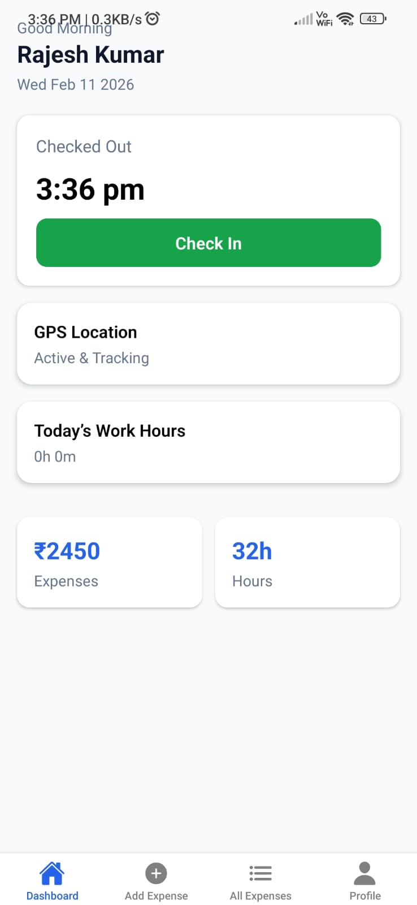
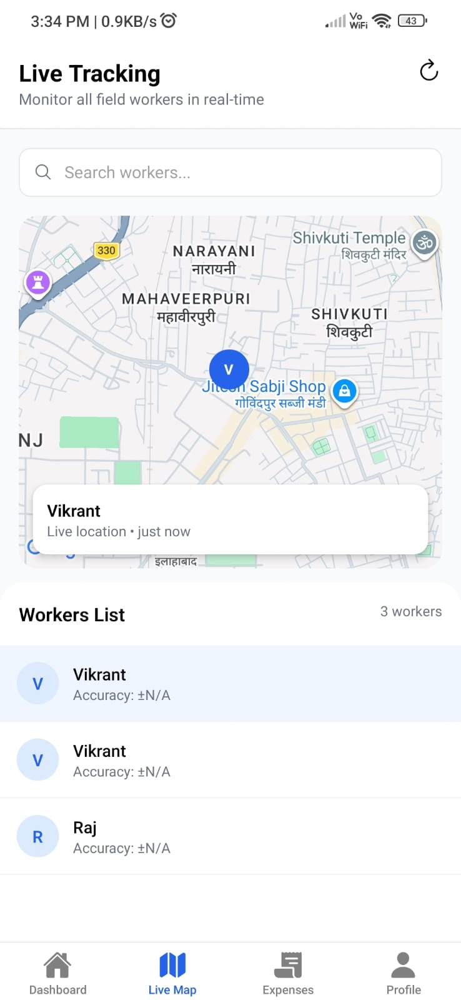
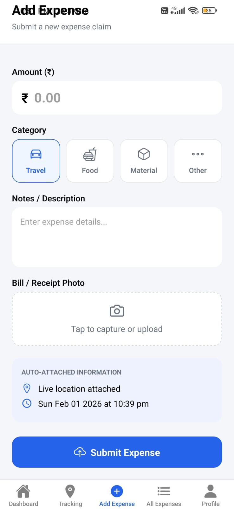

# Field Tracker

A cross-platform mobile application built with **React Native** and **Expo** for tracking field activities, locations, and data in real time.

---

## Table of Contents

- [Overview](#overview)
- [Features](#features)
- [Tech Stack](#tech-stack)
- [Project Structure](#project-structure)
- [Prerequisites](#prerequisites)
- [Getting Started](#getting-started)
- [Running the App](#running-the-app)
- [Dependencies](#dependencies)
- [Contributing](#contributing)
- [License](#license)

---

## Overview

Field Tracker is a mobile-first application designed to help users track and manage field operations. It leverages device GPS for real-time location tracking, supports image capture from the field, and provides an intuitive navigation experience across Android, iOS, and Web platforms.

---

## Features

-  **Real-time Location Tracking** — Uses device GPS via `expo-location` to capture and display field coordinates.
-  **Interactive Maps** — Visualize tracked locations with `react-native-maps`.
-  **Image Capture** — Attach field photos using `expo-image-picker`.
-  **Persistent Storage** — Stores data locally with `@react-native-async-storage/async-storage`.
-  **Bottom Tab Navigation** — Clean, tab-based navigation for easy screen switching.
-  **API Integration** — Connects to backend services via `axios`.
-  **Gradient UI** — Polished interface with `expo-linear-gradient`.
-  **Cross-Platform** — Runs on Android, iOS, and Web.

---

## Screenshots

<p align="center">
  
  
  
</p>

## Tech Stack

| Layer | Technology |
|---|---|
| Framework | React Native 0.81.5 |
| Runtime | Expo ~54.0.32 |
| Language | JavaScript |
| Navigation | React Navigation v7 |
| Maps | react-native-maps |
| Location | expo-location |
| Image Picker | expo-image-picker |
| Storage | AsyncStorage |
| HTTP Client | axios |

---

## Project Structure

```
field-tracker/
├── api/              # API service functions and axios config
├── assets/           # Images, icons, splash screen
├── components/       # Reusable UI components
├── navigation/       # Navigation setup (stack, bottom tabs)
├── screens/          # App screens
├── utils/            # Helper functions and utilities
├── App.js            # Root application component
├── index.js          # App entry point
├── app.json          # Expo configuration
└── package.json      # Dependencies and scripts
```

---

## Prerequisites

Before you begin, make sure you have the following installed:

- [Node.js](https://nodejs.org/) (v18 or higher recommended)
- [npm](https://www.npmjs.com/) or [yarn](https://yarnpkg.com/)
- [Expo CLI](https://docs.expo.dev/get-started/installation/) — install globally with:

```bash
npm install -g expo-cli
```

- [Expo Go](https://expo.dev/client) app on your Android or iOS device (for physical device testing)

---

## Getting Started

1. **Clone the repository**

```bash
git clone https://github.com/Vikrant-Mainwal/field-tracker.git
cd field-tracker
```

2. **Install dependencies**

```bash
npm install
```

---

## Running the App

Start the Expo development server:

```bash
npm start
```

Then choose your target platform:

| Command | Platform |
|---|---|
| `npm run android` | Android emulator or device |
| `npm run ios` | iOS simulator or device (macOS only) |
| `npm run web` | Web browser |

Alternatively, after running `npm start`, scan the QR code in the terminal using the **Expo Go** app on your phone.

---

## Dependencies

Key packages used in this project:

| Package | Version | Purpose |
|---|---|---|
| `expo` | ~54.0.32 | Core Expo SDK |
| `react-native` | 0.81.5 | Mobile framework |
| `@react-navigation/native` | ^7.1.28 | Navigation core |
| `@react-navigation/bottom-tabs` | ^7.10.1 | Tab navigation |
| `@react-navigation/native-stack` | ^7.11.0 | Stack navigation |
| `expo-location` | ~19.0.8 | GPS location access |
| `react-native-maps` | 1.20.1 | Map rendering |
| `expo-image-picker` | ~17.0.10 | Camera / gallery access |
| `@react-native-async-storage/async-storage` | 2.2.0 | Local data persistence |
| `axios` | ^1.13.4 | HTTP requests |
| `expo-linear-gradient` | ~15.0.8 | Gradient UI elements |
| `react-native-vector-icons` | ^10.3.0 | Icon library |
| `@react-native-picker/picker` | 2.11.1 | Dropdown picker |

---

## Contributing

Contributions are welcome! To get started:

1. Fork the repository
2. Create a new branch: `git checkout -b feature/your-feature-name`
3. Commit your changes: `git commit -m "Add your feature"`
4. Push to the branch: `git push origin feature/your-feature-name`
5. Open a Pull Request

Please make sure your code follows existing conventions and is tested on at least one platform before submitting.

---

## License

This project is private. All rights reserved © Vikrant Mainwal.
